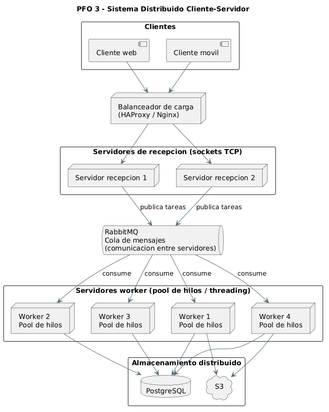

# PFO 3 — Rediseño como Sistema Distribuido (Cliente-Servidor)

Sistema cliente-servidor. El cliente envía una lista de tareas, el servidor las encola
y las reparte entre los workers; cada worker procesa una tarea y devuelve el resultado al
cliente que la originó, indicando **qué worker** la atendió y con qué métricas.

## Componentes

- `servidor.py` — escucha en el puerto 5000, levanta un pool de **4 workers** (hilos),
  encola las tareas recibidas y devuelve el resultado de cada una.
- `cliente.py` — se conecta al servidor, envía su lista de tareas y muestra los resultados.
- `src/diagrama.png` — diagrama de la arquitectura distribuida objetivo.

## Cómo ejecutar

### 1. Iniciar el servidor
En una terminal, dentro de la carpeta del proyecto:

```bash
python servidor.py
```

El servidor levanta el pool de workers y queda escuchando en el puerto.

### 2. Iniciar el cliente
En una segunda terminal:

```bash
python cliente.py
```

El cliente envía su lista de tareas y muestra el resultado de cada una, indicando qué
worker la procesó, el tiempo de cómputo y un par de métricas (palabras y caracteres).

### 3. Probar la distribución entre workers
1. Abrir una o más terminales adicionales y ejecutar `python cliente.py` en cada una.
2. Observar en la consola del **servidor** cómo las tareas de los distintos clientes se
   reparten entre los **mismos 4 workers** de forma concurrente.
3. En la consola del **cliente** se nota que los resultados pueden volver **desordenados**:
   eso evidencia que se procesaron en paralelo y que cada uno tardó un tiempo distinto.


## Arquitectura distribuida objetivo

El siguiente diagrama representa el sistema escalado a producción: clientes web/móvil
detrás de un **balanceador de carga**, servidores de recepción que publican en una **cola de
mensajes (RabbitMQ)**, un cluster de **workers con pool de hilos** y **almacenamiento
distribuido** (PostgreSQL y S3).


